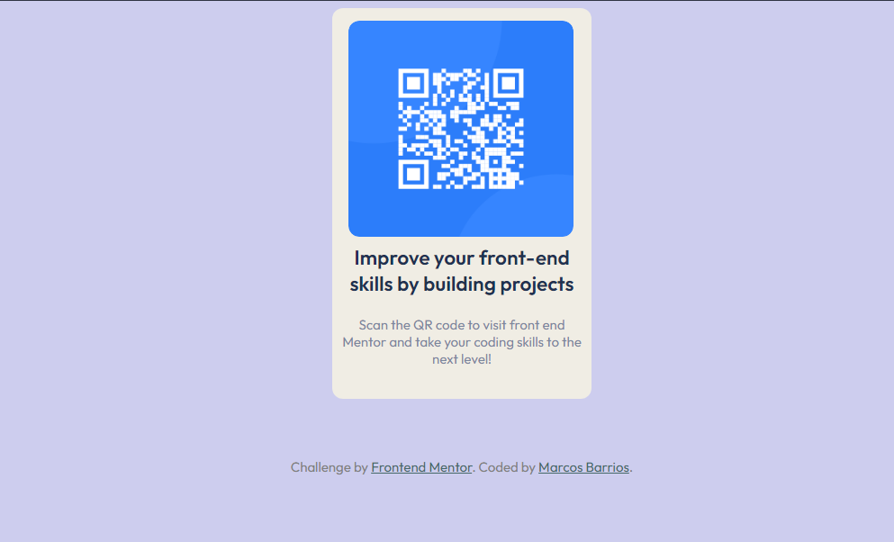

# Frontend Mentor - QR code component solution

This is a solution to the [QR code component challenge on Frontend Mentor](https://www.frontendmentor.io/challenges/qr-code-component-iux_sIO_H). Frontend Mentor challenges help you improve your coding skills by building realistic projects. 

## Table of contents

- [Overview](#overview)
  - [Screenshot](#screenshot)
  - [Links](#links)
- [My process](#my-process)
  - [Built with](#built-with)
  - [What I learned](#what-i-learned)
  - [Continued development](#continued-development)
- [Author](#author)
- [Acknowledgments](#acknowledgments)

**Note: Delete this note and update the table of contents based on what sections you keep.**

## Overview

### Screenshot



There is the path to the SS for the finished project


### Links

- Solution URL: (https://your-solution-url.com)
- Live Site URL: (https://toxgem.github.io/qr-code-component-main/)

## My process

This is my first time using Git to make a repository for a project so it's my first baby steps, i've being doing a few projects of my own but haven't published like this, so since I'm new still to programming I struggle quite a bit with the css file, there was much of trial and error, kinda eye measuring things, using dev tools and a lot of googling things

### Built with

- Semantic HTML5 markup
- CSS custom properties


### What I learned

@import tag

One of the few things that i learned about in this challenge was the @impor tag for css
I've been using the <link rel...> format to import any font untill now, a new thing to collect
```


### Continued development

I am still struggling with  CSS styling so i am still looking for a personal look, something that can be made my own, but for now i'll will try to code a few new things to get better.

I am looking for future feedback, I will receive any sugestions for improvements


## Author

- Website - (https://github.com/Toxgem)
- Frontend Mentor - (https://www.frontendmentor.io/profile/Toxgem)


## Acknowledgments

A good frind of mine suggested a few changes here and there in the margin themes, contrast checkers,
so big props for Jonathan and Omar
Thanks to Lucas and Hyron for their advices


